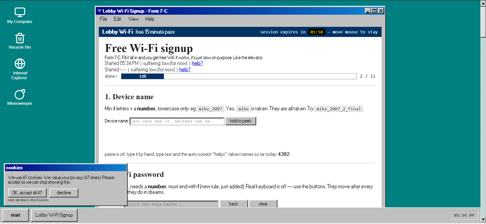
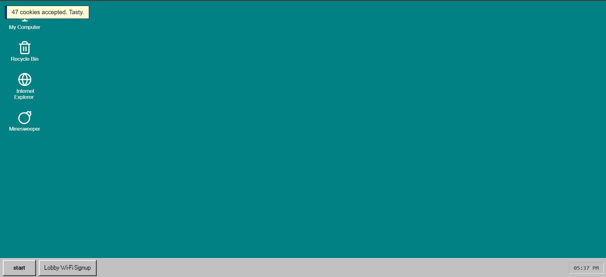

# Lobby Free Wi-Fi (Bad ui)

Ordinary task: **sign up for free lobby wifi (yeh its very easy..)**

*(You just have to complete all task and fill the form to get the free lobby wifi)*

*(This website is build using vanilla and uses legacy windows style for more fun.)*

## *Screenshots*

 **This is the form.(go fill it to get free wifi ! yay)**


 **This is no form.(yeh)**

## *Stuff used*
- https://jdan.github.io/98.css/ (buttons only -the rest broke the things so it went.)
- button idea from https://uiverse.io/
- photos https://picsum.photos + https://pravatar.cc
- icons https://lucide.dev
- sounds inspired by https://kenney.nl/assets/interface-sounds (re-made with webaudio)

## *Want to run locally* :

Clone the repo using git clone command(yeh i know you know how to do it).

```
npm install 
```
```
npm run dev
```
```
npm run build
```
**Requirements to run locally(at least):**
- A internet connection (yeh i know you have it.)
- Node.js & npm(download from [nodejs](https://nodejs.org))

**How to contribute**
- Contribution are open but the last time someone contributed the printer got dead...

(*Um , this repo is now archived cuz i can't think of anything i can add more in this so bye ^_^*)
 

*******************************************************************************************************************
*(Page last updated march 2011. if it doesn't work, unplug the router, count to 10, plug it back. made by a person on the slow computer. No router was harmed in development.)*

*Made in fun by teen for [hackclub ysws](https://crescent.hackclub.com)*
